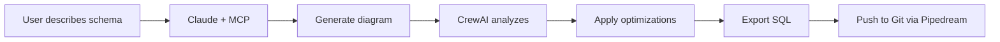
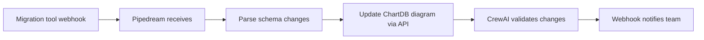
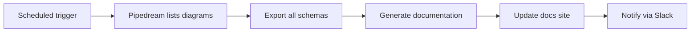

# ChartDB Integration Guide

Complete guide for integrating ChartDB with Pipedream workflows, MCP-enabled AI assistants, and CrewAI agents.

## Table of Contents

1. [Overview](#overview)
2. [MCP Server Integration](#mcp-server-integration)
3. [Pipedream Integration](#pipedream-integration)
4. [CrewAI Agents](#crewai-agents)
5. [REST API](#rest-api)
6. [Complete Workflows](#complete-workflows)
7. [Troubleshooting](#troubleshooting)

## Overview

This integration enables:

- **MCP Server**: Expose ChartDB functionality to AI assistants (Claude, GPT, etc.)
- **Pipedream**: Automate database diagram workflows
- **CrewAI**: Intelligent schema analysis and optimization
- **REST API**: Programmatic access to all features

### Architecture

```
┌─────────────────────────────────────────────────────────────┐
│                         ChartDB Core                        │
└─────────────────────────────────────────────────────────────┘
                            │
         ┌──────────────────┼──────────────────┐
         │                  │                  │
         ▼                  ▼                  ▼
┌─────────────────┐ ┌─────────────┐ ┌─────────────────┐
│   MCP Server    │ │  REST API   │ │ CrewAI Agents   │
│  (AI Access)    │ │ (HTTP/JSON) │ │ (Intelligence)  │
└─────────────────┘ └─────────────┘ └─────────────────┘
         │                  │                  │
         └──────────────────┼──────────────────┘
                            │
                            ▼
                  ┌─────────────────┐
                  │    Pipedream    │
                  │   (Workflows)   │
                  └─────────────────┘
```

## MCP Server Integration

### Setup

1. **Install dependencies**:
```bash
cd mcp-server
npm install
npm run build
```

2. **Configure Claude Desktop**:

Add to `~/Library/Application Support/Claude/claude_desktop_config.json`:

```json
{
  "mcpServers": {
    "chartdb": {
      "command": "node",
      "args": ["/absolute/path/to/chartdb/mcp-server/dist/index.js"]
    }
  }
}
```

3. **Restart Claude Desktop**

### Using MCP with Claude

#### Create a Diagram

```
Create a PostgreSQL diagram for an e-commerce platform with:
- Users (id, email, name, password_hash)
- Products (id, name, description, price, stock)
- Orders (id, user_id, total, status)
- Order Items (id, order_id, product_id, quantity, price)

Add appropriate relationships between tables.
```

Claude will use the MCP tools to:
1. Create the diagram
2. Add tables with fields
3. Create relationships
4. Export as SQL

#### Analyze a Diagram

```
Analyze diagram://abc123 and provide optimization suggestions
```

Claude will:
1. Read the diagram via MCP resource
2. Use the `optimize_schema` prompt
3. Provide detailed recommendations

### Available MCP Resources

- `diagrams://list` - List all diagrams
- `diagram://{id}` - Get specific diagram

### Available MCP Tools

- `create_diagram` - Create new diagram
- `add_table` - Add table to diagram
- `add_relationship` - Create relationship
- `add_area` - Group tables visually
- `add_note` - Add documentation
- `export_sql` - Export as SQL DDL
- `export_dbml` - Export as DBML

### Available MCP Prompts

- `generate_diagram` - Generate from description
- `optimize_schema` - Get optimization suggestions
- `explain_diagram` - Get clear explanation
- `migrate_database` - Migrate to different DB type
- `validate_schema` - Check for issues

## Pipedream Integration

### Setup

1. **Create Pipedream Account**: https://pipedream.com

2. **Configure ChartDB App**:
   - Go to Account > Apps
   - Add ChartDB
   - Enter API URL and key

3. **Import Components**:
   - Copy components from `pipedream/components/chartdb/`
   - Upload to your Pipedream workspace

### Example Workflows

#### 1. Auto-Generate Diagrams from Database Changes

**Trigger**: Webhook  
**Use Case**: Automatically create diagrams when schema changes

```yaml
Trigger: HTTP Webhook
↓
Action: Parse Schema (Node.js)
↓
Action: Create Diagram (ChartDB)
↓
Action: Add Tables (ChartDB)
↓
Action: Notify Team (Slack)
```

#### 2. Version Control for Diagrams

**Trigger**: Diagram Updated (ChartDB Source)  
**Use Case**: Keep schemas in Git

```yaml
Trigger: ChartDB Diagram Updated
↓
Action: Export SQL (ChartDB)
↓
Action: Export DBML (ChartDB)
↓
Action: Commit to GitHub
↓
Action: Create Pull Request
```

#### 3. Daily Documentation Updates

**Trigger**: Schedule (Cron)  
**Use Case**: Automated documentation

```yaml
Trigger: Schedule (Daily 9am)
↓
Action: List Diagrams (ChartDB)
↓
Action: Generate Markdown Docs (Node.js)
↓
Action: Update Documentation Site (GitHub)
↓
Action: Notify Team (Slack)
```

### Available Pipedream Actions

- **create-diagram** - Create new diagram
- **add-table** - Add table to diagram
- **add-relationship** - Create relationship
- **export-diagram** - Export diagram

### Available Pipedream Sources

- **diagram-updated** - Trigger on diagram changes
- **new-diagram** - Trigger on new diagrams

## CrewAI Agents

### Setup

1. **Install**:
```bash
cd crewai-agents
npm install
npm run build
```

2. **Configure API Key** (for AI features):
```bash
export OPENAI_API_KEY=your_key_here
```

### Command Line Usage

#### Generate Diagram

```bash
npm start generate "Blog platform with users, posts, comments, and tags" postgresql
```

Output:
- Complete diagram with tables and relationships
- Schema analysis report
- Optimization recommendations
- Optimized layout

#### Analyze Diagram

```bash
npm start analyze
```

Provides:
- Issue detection
- Normalization analysis
- Performance recommendations
- Implementation guidance

#### Validate Schema

```bash
npm start validate
```

Checks for:
- Missing primary keys
- Naming convention issues
- Relationship problems
- Potential performance issues

### Programmatic Usage

```typescript
import { SchemaCrew } from '@chartdb/crewai-agents';

const crew = new SchemaCrew();

// Generate and optimize
const result = await crew.generateAndOptimize(
  'Social network with users, posts, and friendships',
  'postgresql'
);

console.log('Diagram:', result.data.diagram);
console.log('Optimization Score:', result.data.optimization.score);

// Analyze existing
const analysis = await crew.analyzeDiagram(existingDiagram);
console.log(analysis.data.analysisReport);

// Validate
const validation = await crew.validateDiagram(diagram);
if (!validation.data.isValid) {
  console.log('Errors:', validation.data.errors);
}
```

### Available Agents

1. **Schema Analyzer** - Detects issues and patterns
2. **Diagram Generator** - Creates optimal schemas
3. **Optimization Agent** - Provides performance recommendations

### Agent Capabilities

- Natural language understanding
- Schema normalization analysis
- Index optimization
- Naming convention enforcement
- Relationship validation
- Performance scoring

## REST API

### Setup

The REST API is integrated into the ChartDB application.

### Authentication

Include API key in headers:

```bash
curl -H "Authorization: Bearer YOUR_API_KEY" \
     https://api.chartdb.io/api/diagrams
```

### Rate Limiting

- 100 requests per minute per API key
- 429 status code when limit exceeded
- `X-RateLimit-Remaining` header shows remaining quota

### Endpoints

#### Diagrams

```bash
# List diagrams
GET /api/diagrams

# Get diagram
GET /api/diagrams/:id

# Create diagram
POST /api/diagrams
{
  "name": "My Database",
  "databaseType": "postgresql"
}

# Update diagram
PUT /api/diagrams/:id

# Delete diagram
DELETE /api/diagrams/:id

# Export diagram
GET /api/diagrams/:id/export/:format
# format: json | sql | dbml
```

#### Tables

```bash
# Add table
POST /api/diagrams/:id/tables
{
  "name": "users",
  "fields": [
    {"name": "id", "type": "INTEGER", "primaryKey": true},
    {"name": "email", "type": "VARCHAR(255)", "unique": true}
  ]
}
```

#### Relationships

```bash
# Add relationship
POST /api/diagrams/:id/relationships
{
  "sourceTableId": "table-1",
  "targetTableId": "table-2",
  "sourceFieldId": "field-1",
  "targetFieldId": "field-2",
  "type": "many_to_one"
}
```

#### Webhooks

```bash
# Create webhook
POST /api/webhooks
{
  "url": "https://your-server.com/webhook",
  "events": ["diagram.created", "diagram.updated"],
  "secret": "your-secret"
}

# List webhooks
GET /api/webhooks

# Delete webhook
DELETE /api/webhooks/:id
```

### Webhook Events

- `diagram.created` - New diagram created
- `diagram.updated` - Diagram modified
- `diagram.deleted` - Diagram removed
- `table.added` - Table added to diagram
- `relationship.added` - Relationship created

### Webhook Payload

```json
{
  "event": "diagram.created",
  "timestamp": "2026-02-17T12:00:00Z",
  "data": {
    "diagramId": "abc123",
    "name": "My Database",
    "databaseType": "postgresql"
  }
}
```

## Complete Workflows

### Workflow 1: AI-Assisted Schema Design



### Workflow 2: Database Migration Automation



### Workflow 3: Continuous Documentation



## Troubleshooting

### MCP Server Issues

**Problem**: Claude doesn't see ChartDB tools

**Solution**:
1. Check `claude_desktop_config.json` path is correct
2. Restart Claude Desktop
3. Check server logs: `tail -f ~/.claude/logs/mcp-server.log`

**Problem**: Import errors in MCP server

**Solution**:
```bash
cd mcp-server
rm -rf node_modules dist
npm install
npm run build
```

### Pipedream Issues

**Problem**: ChartDB actions not available

**Solution**:
1. Verify API credentials in Pipedream
2. Check API endpoint is reachable
3. Test with curl first

**Problem**: Webhook not triggering

**Solution**:
1. Check webhook URL is accessible
2. Verify events are correctly configured
3. Check webhook logs in ChartDB

### CrewAI Issues

**Problem**: Agent generation fails

**Solution**:
1. Check OpenAI API key is set
2. Verify network connectivity
3. Check input format matches expected schema

**Problem**: Poor quality schema generation

**Solution**:
1. Provide more detailed descriptions
2. Specify exact field names and types
3. Mention relationships explicitly

### API Issues

**Problem**: 401 Unauthorized

**Solution**:
- Verify API key is correct
- Check Authorization header format: `Bearer YOUR_KEY`

**Problem**: 429 Rate Limited

**Solution**:
- Implement exponential backoff
- Cache responses when possible
- Consider upgrading API tier

## Best Practices

### Security

1. **Never commit API keys** to version control
2. **Use environment variables** for secrets
3. **Rotate API keys** regularly
4. **Validate webhook signatures**

### Performance

1. **Cache diagram data** when possible
2. **Use pagination** for large result sets
3. **Implement retry logic** with backoff
4. **Monitor rate limits**

### Development

1. **Test in development** before production
2. **Use version control** for workflows
3. **Document custom integrations**
4. **Monitor webhook deliveries**

### Schema Design

1. **Follow normalization principles**
2. **Use consistent naming conventions**
3. **Add indexes for foreign keys**
4. **Include timestamp fields**

## Support

- **Documentation**: https://chartdb.io/docs
- **GitHub Issues**: https://github.com/chartdb/chartdb/issues
- **Discord**: https://discord.gg/chartdb
- **Email**: support@chartdb.io

## Examples Repository

Find complete working examples at:
https://github.com/chartdb/integration-examples

Includes:
- Sample Pipedream workflows
- MCP usage examples
- CrewAI integration code
- API client libraries

## Contributing

We welcome contributions! See [CONTRIBUTING.md](CONTRIBUTING.md) for:
- Code style guidelines
- Testing requirements
- Pull request process
- Community guidelines

## License

This integration is released under the same license as ChartDB.
See [LICENSE](LICENSE) for details.
